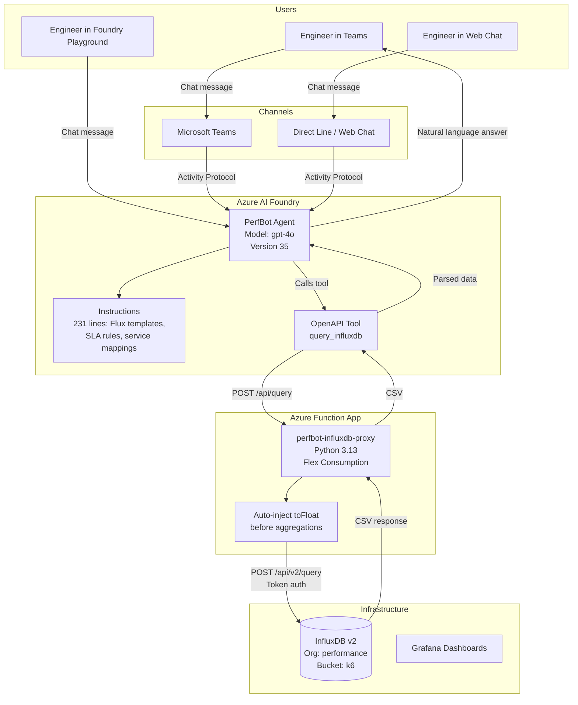

# PerfBot Architecture

## Overview

PerfBot is an AI-powered performance engineering assistant deployed on **Azure AI Foundry**. It answers natural-language questions about K6 performance test results by querying InfluxDB through an Azure Function proxy.

## Architecture Diagram

## Components

| # | Component | Technology | Purpose |
|---|-----------|-----------|---------|
| 1 | AI Agent | Azure AI Foundry (GPT-4o v30) | Intent parsing, Flux query generation, response narration |
| 2 | System Prompt | instructions.txt (231 lines) | Service mappings, SLA rules, Flux templates, response behavior |
| 3 | OpenAPI Tool | openapi-influxdb.json | Declares `query_influxdb` function for the agent to call |
| 4 | Function Proxy | Azure Function (Python 3.13) | Bridges Foundry → InfluxDB, auto-injects toFloat() |
| 5 | Data Store | InfluxDB v2 | K6 performance metrics (http_req_duration, http_reqs, etc.) |
| 6 | Bot Service | Azure Bot (perfbot53601) | Routes Teams/Web Chat messages to Foundry agent |

## Data Flow (Step by Step)

1. **User asks** in Teams: "Did platform-objectdb-api pass SLA?"
2. **Foundry agent** parses intent using GPT-4o + system prompt
3. **Agent resolves** service name → InfluxDB testName mapping
4. **Agent builds Flux query** using template from instructions
5. **Tool call**: POST to Azure Function with the Flux query
6. **Function**: Auto-injects `toFloat()` if missing, forwards to InfluxDB
7. **InfluxDB**: Executes Flux, returns CSV
8. **Function**: Returns CSV to Foundry
9. **Agent parses CSV**: Extracts testId, p95 values per endpoint
10. **Agent applies SLA logic**: Checks all p95 < 2000ms
11. **Agent responds**: Clear verdict with metrics in natural language

## Key Design Decisions

| Decision | Rationale |
|----------|-----------|
| Azure Function proxy | Foundry can't reach private IPs; Function bridges the gap |
| Anonymous auth on Function | Simplifies Foundry connection; acceptable for internal tool |
| Auto-inject `toFloat()` | InfluxDB stores values as strings; model sometimes forgets the cast |
| GPT-4o over GPT-5 | More reliable tool-calling behavior for structured queries |
| CSV response format | InfluxDB native output; lighter than JSON for large result sets |
| 231-line system prompt | Encodes all domain knowledge so the agent never asks the user for technical details |

## Azure Resources

| Resource | Details |
|----------|---------|
| Resource Group | rg-hackathon-Perf-Alchemists |
| AI Foundry Project | perf-alchemists-project |
| Function App | perfbot-influxdb-proxy |
| Bot Registration | perfbot53601 |
| Region | East US 2 |
