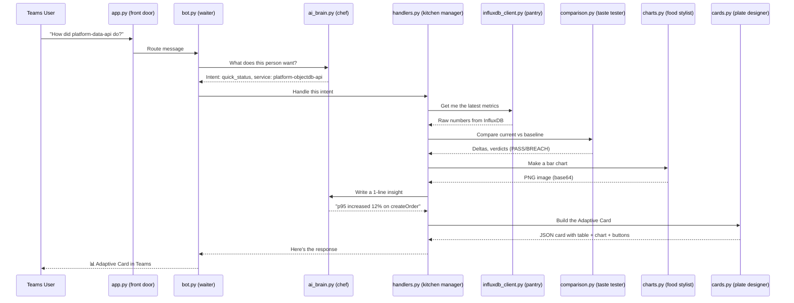

# PerfBot Architecture — Simple Explanation

## The Big Picture

PerfBot is like a **restaurant**:

```
Customer (Teams user) → Waiter (bot.py) → Chef (ai_brain.py) → Kitchen Staff → Plated Dish (Adaptive Card)
```

---

## The Flow (what happens when someone asks a question)



---

## What Each File Does

| File | Role | Analogy |
|------|------|---------|
| **`app.py`** | Starts the web server, listens on port 3978 | The restaurant's front door |
| **`src/bot.py`** | Receives Teams messages, strips @mentions, sends responses | The waiter taking your order |
| **`src/ai_brain.py`** | Sends your question to GPT-4o, gets back structured intent (what service? what type of question?) | The chef who reads the order ticket |
| **`src/handlers.py`** | Routes the intent to the right logic (status? comparison? drill-down?) | Kitchen manager assigning tasks |
| **`src/influxdb_client.py`** | Talks to InfluxDB, runs Flux queries, gets raw metric data | The pantry/fridge where ingredients live |
| **`src/comparison.py`** | Compares current run vs baseline — calculates deltas, finds breaches | Taste tester (is this better or worse than last time?) |
| **`src/charts.py`** | Generates bar/line chart images with matplotlib | The food stylist making it look pretty |
| **`src/cards.py`** | Builds the Adaptive Card JSON (the rich response with tables/buttons) | The plate designer — final presentation |
| **`src/grafana.py`** | Builds Grafana dashboard URLs with correct time range | Prints the receipt with a link to the full meal |
| **`src/proactive_alerts.py`** | Polls every 5 min — if a run finishes with breaches, pushes alert to channel without being asked | The smoke alarm in the kitchen |
| **`src/config.py`** | Loads settings from `.env` file | The restaurant's configuration (hours, phone, address) |
| **`src/constants.py`** | Maps service names/aliases to InfluxDB testNames, defines SLA thresholds | The menu — what we serve and the rules |

---

## The 3 Key Decisions GPT-4o Makes

1. **"What does the user want?"** → Intent (quick_status, comparison, drill_down, etc.)
2. **"Which service?"** → Resolves fuzzy names ("platform data" → `platform-objectdb-api`)
3. **"What's the insight?"** → Writes a human-friendly 1-liner about the results

Everything else (querying InfluxDB, comparing numbers, making charts) is **deterministic code** — no AI needed.

---

## Proactive Alerts (no user question needed)

```
Every 5 min:
  proactive_alerts.py polls InfluxDB for new completed runs
      ↓
  New run found? → Check SLA thresholds
      ↓
  Breach detected? → Push Adaptive Card to Teams channel automatically
      ↓
  No breach? → Stay silent
```

---

## Files You Don't Touch During Development

| File | Purpose |
|------|---------|
| `Dockerfile` | Packages the app into a container |
| `deploy/deployment.yaml` | Kubernetes manifest for running in AKS cluster |
| `deploy/secrets.yaml` | Secret template (fill values before applying) |
| `teams-manifest/manifest.json` | Teams app definition (uploaded to Teams Admin) |
| `.env.example` | Template — copy to `.env` and fill in secrets |

---

## Supported Query Types (10 total)

| # | Query | Intent | Example |
|---|-------|--------|---------|
| 1 | Quick Status | `quick_status` | "How did platform-data-api do?" |
| 2 | Pass/Fail | `pass_fail` | "Did last night's run pass?" |
| 3 | All Services | `all_services_scan` | "Any failures today?" |
| 4 | Comparison | `comparison` | "Compare build X vs Y" |
| 5 | Trends | `trends` | "Show last 5 runs for contract-api" |
| 6 | Drill-down | `drill_down` | "Which APIs are slowest?" |
| 7 | Regressions | `regressions` | "What regressed?" |
| 8 | SLA Check | `sla_check` | "Is platform-data-api within SLA?" |
| 9 | Active Runs | `active_runs` | "Is anything running right now?" |
| 10 | Grafana Link | `grafana_link` | "Show me the Grafana link" |

---

## Key Rules (hardcoded knowledge)

- InfluxDB org is **`performance`** (NEVER `conga`)
- Values in InfluxDB are strings → always `toFloat()` before math
- Exclude setup calls: `getBuildId`, `generateClientCredentialsToken`
- Grafana links MUST include `&from=<epoch_ms>&to=<epoch_ms>` (otherwise shows empty)
- Service name resolution: "platform data" / "PDA" → `platform-objectdb-api`

---

## Tech Stack Summary

| Layer | Tool |
|-------|------|
| Brain (intent + insight) | Azure OpenAI GPT-4o (via AI Foundry) |
| Bot framework | Bot Framework SDK (Python) + aiohttp |
| Data source | InfluxDB v2 HTTP API (Flux queries) |
| Charts | matplotlib (server-side PNG → base64) |
| Rich responses | Adaptive Cards v1.5 |
| Hosting | Azure App Service or AKS |
